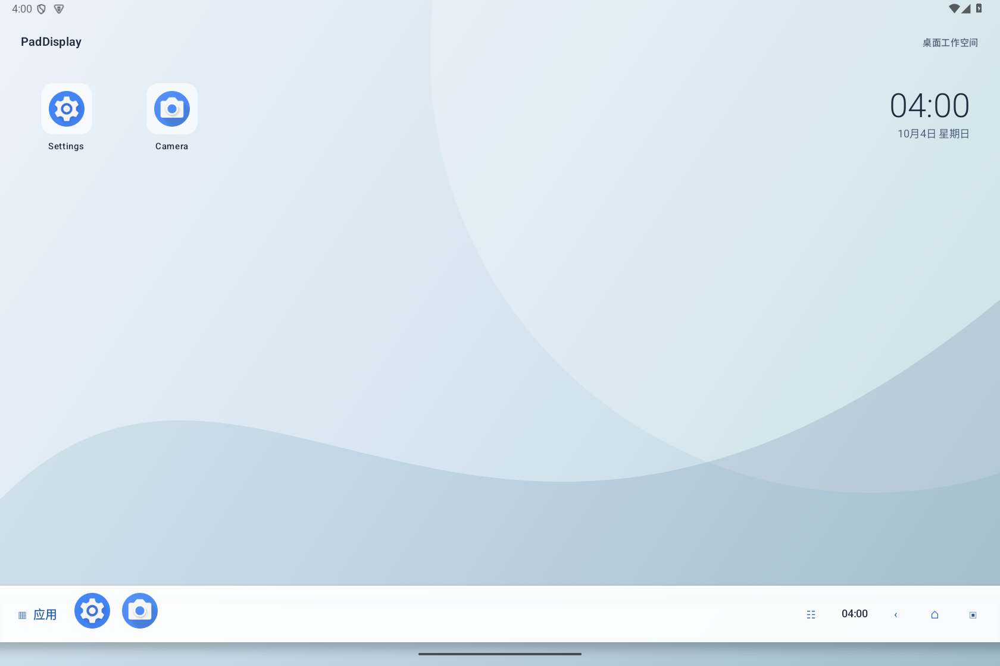

# PadDisplay v1.0.4

把 Android 平板的**物理外接显示器**变成桌面工作空间。面向 OPPO Pad Mini / Android 16 / ColorOS，使用 Shizuku 提供系统控制权限，无需 Root。

[下载 v1.0.4 APK](https://github.com/alexhuangblankad/PadDisplay/releases/tag/v1.0.4) · [使用指南](docs/desktop-guide.md) · [交接与源码证据](docs/HANDOFF.md)



[亮色桌面预览](docs/images/desktop-preview-light.png)

*上图为模拟器 UI 夹具预览，刻意排除 Google 应用，展示桌面快捷方式与完整任务栏；不是 OPPO 物理外屏实测截图。*

## 桌面与操作

- 外屏横向桌面：柔和渐变壁纸、左侧快捷方式、紧凑时钟、完整底部任务栏、应用启动台、搜索和收藏。设计参考 [三星 DeX](https://www.samsung.com/us/support/answer/ANS10002880/) 和 [华为桌面模式](https://consumer.huawei.com/en/support/content/en-us15881671/)，独立实现。
- 底部图标 Dock：收藏优先，其次选择本机实际安装的浏览器、文件管理、设置、相册等应用；空收藏也有默认快捷方式，不要求 Google 套件。支持运行窗口、应用启动与任务切换。桌面内置 Dock 不依赖悬浮权限；跨应用常驻 Dock 需要系统允许悬浮显示。
- 自由窗口：请求真实系统 freeform；支持关闭、全屏、恢复窗口、左右排列和尺寸调整。可见自由窗口提供标题条和右下角调整手柄，松开后提交并验证实际边界。
- 右下角导航：返回、Home、多任务。Home 返回外屏桌面，多任务展示外屏窗口；返回按键定向发往当前物理外屏。
- 保留系统侧边返回手势，不添加全屏或屏幕边缘触摸拦截层。
- 全屏救援导航：在高级设置开启“PadDisplay 全屏导航快捷键”辅助服务后，Alt+Shift 或 F9（键盘上报 F9 时也支持 Fn+F9）临时唤出全屏 Dock、窗口控件和底部中央三键，15 秒后隐藏。面板临时获得焦点；Alt/Shift 按下和抬起原样放行，单独 UU 左 Alt 不触发，不处理鼠标、不读取窗口内容。
- 控制中心：媒体音量、平板亮度、Wi-Fi / 蓝牙系统设置、亮暗主题；显示缩放和音频输出等复杂配置留在高级设置。
- 支持亮色、暗色和跟随系统；主页面采用状态栏安全区，保留内屏电源快捷按钮。

## 显示、鼠标与音频

- 枚举硬件支持的显示模式，可选择真实分辨率与刷新率；支持设备上使用 4K@60Hz。
- 外屏缩放 75%–200%，修改外屏 DPI，保留分辨率信号；15 秒确认，否则恢复，并记忆显示器配置。
- 主机模式将原生鼠标关联到外屏；退出先恢复内屏并将鼠标明确关联回平板，读回验证。
- 可单独关闭平板内屏；外屏断开时尝试恢复内屏；提供音频设备与媒体路由控制。
- 全屏应用默认隐藏悬浮 Dock、导航与窗口装饰，Alt+Shift / F9 可临时唤出；Moonlight 前台同样默认隐藏，不转发鼠标事件，不绘制替代光标。

**退出主机模式的含义**：撤掉 PadDisplay 外屏桌面和悬浮层，尝试将桌面应用迁回内屏、恢复 DPI，让系统重新接管显示器，鼠标回平板。用户称之为“复制”，这里恢复的是连接显示器时的系统效果，不额外强制镜像。仅回迁本次主机启动的应用，跳过混有其它应用的共享根任务。退出会移除自己的桌面任务记录，不改厂商配置或调度策略；ROM 拒绝时保留错误。

## 快速开始

1. 安装 release APK，启动 Shizuku 并授权 PadDisplay。
2. 接入 USB-C / DisplayPort 物理显示器及鼠标。
3. 点击“开启主机”。如跨应用 Dock 不出现，在高级设置允许“显示在其它应用上层”；应用也会尝试仅开启自己的悬浮 app-op。
4. 在外屏启动台或内屏应用表格打开应用。窗口能力由 ROM 和应用共同决定。
5. 在高级设置调整显示、缩放、音频或检查诊断；点击“退出并恢复”返回系统默认显示效果。

## 兼容性与验证

用户已反馈此前版本的**鼠标归属、缩放和显示正常**。此前 v1.0.0 通过 release 构建、签名检查、模拟器安装、桌面 / 控制中心亮暗布局预览、实际音量调整、5000 组窗口布局与 DPI 异常路径检查。

v1.0.4 前端全屏对齐用户已确认有效的工作台启动路径，自由窗口失败时请求全屏回退并保留窗口失败提示；全屏控件默认隐藏，Alt+Shift 临时唤出。对照 Taskbar 与 AOSP 修正了真实 Settings 键名；此前带 development_ 前缀的诊断不能证明功能开启。避免复用内屏全屏任务，主机启动不自动改全局设置，真实 OPPO 效果未验证。研究见 [自由窗口对照](docs/freeform-research.md)。v1.0.3 改为启动前提交目标显示器、窗口模式与基于外屏逻辑工作区的初始边界；窗口页显示应用实际 dp、DPI 和 appBounds。4K 输出不能证明应用配置正确，本版无 ColorOS 真机验证。前端改为紧凑时钟、统一线条导航、轻量图标与鼠标悬停反馈，亮暗预览通过。v1.0.2 修正了应用启动后遗漏窗口边界设置的问题；切换自由窗口同时验证模式与边界，并在失败后通过系统最近任务接口再次请求。用户反馈 v1.0.1 所有应用窗口缩放无效，本版尚无真机成功证据。v1.0.1 另外检查了无 Google / 空收藏的 OPPO 应用列表和新版桌面布局。本次无法连接 OPPO 真机。新增外屏 Dock、自由窗口装饰、平板亮度和应用回迁仍需 ColorOS 实测；构建与 UI 预览不能证明厂商系统允许这些接口。自由窗口不支持时返回明确失败，不将全屏回退当作自由窗口成功。

全屏快捷键基于 Android 的 [按键过滤能力](https://developer.android.com/reference/android/accessibilityservice/AccessibilityServiceInfo#FLAG_REQUEST_FILTER_KEY_EVENTS)，需用户在系统设置开启该服务。若键盘把 Fn+F9 处理成媒体键而未上报 F9，此组合无法触发；系统侧边返回以及 Moonlight / UU 的实际捕获行为仍需对应设备与客户端验证。平板上的高级设置也提供手动唤出入口。

**没有实现鼠标从一块屏边缘自然滑到另一块屏。** 设备关联实现的是鼠标固定到指定屏幕。关闭 `display_topology` 的 ROM 尚无本项目验证成功的连续双屏坐标方案。系统侧边返回手势是否在外屏派发也取决于 ROM。

## 构建

Java 17、Android SDK 36、Gradle 8.13，最低 Android 8（API 26），target SDK 34。

```powershell
$env:ANDROID_HOME = 'D:\android-sdk'
.\gradlew.bat :app:assembleRelease --console=plain
```

产物：`app/build/outputs/apk/release/app-release.apk`。只分发 release APK。

仓库原有签名用于兼容现有安装；该开发密钥已公开，不能提供正式发行密钥的安全保证。自建发行可通过 Gradle 的 `paddisplay.keystore`、`paddisplay.keystore.password`、`paddisplay.key.alias`、`paddisplay.key.password` 属性使用自己的签名。

## 实现与文档

桌面、窗口控制和资源均独立实现，没有移植 VoyageOS 的代码、资源或付费验证。APK 不包含第三方桌面环境，不为增加包体积填充素材。

- [完整交接文档](docs/HANDOFF.md)：历史诊断、源码证据与当前状态。
- [桌面使用与真机验收](docs/desktop-guide.md)。
- [输入关联验证](docs/input-routing-validation.md)。
- [v1.0.4 发布说明](tools/release-notes-1.0.4.md)。
